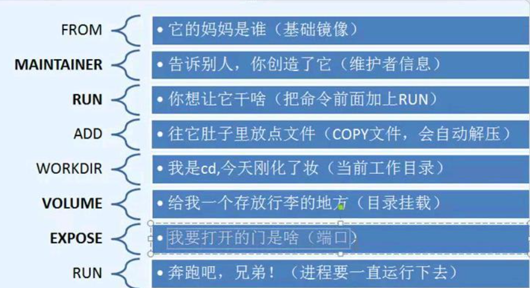

# DockerFile

## 脚本命令



``` bash
FORM：基础镜像，继承，一切都基于这个开始构建
MAINATINER：指明镜像作者，默认姓名+邮箱
RUN：docker构建的时候需要构建的命令
ADD：添加内容，如tomcat镜像这个压缩包
WORKDIR：镜像的工作目录
VOLUME：挂载的目录
EXPOSE：对外暴露端口
CMD：指定这个容器启动时要运行的命令，重复替换
ENTRYPOINT：指定这个容器启动时要运行的命令，追加
ONBUILD：当运行继承DockerFile的时候就会运行ONBUILD指令
COPY：将文件拷贝到镜像中
EVN：构建的时候设置环境变量
```


## 编写DockerFile脚本

- 编写脚本

``` dockerfile
FROM centos
MAINTAINER abraham<1135530168@qq.com>

ENV MYPATH /usr/local/docker
WORKDIR MYPATH

RUN yum -y install vim
RUN yum -y install net-tools

EXPOSE 80

CMD echo $MYPATH
CMD echo "----end----"
CMD /bin/bash
```


- 通过脚本构建镜像

``` bash
docker build -f [dockerfile] -t mycentos:0.1
```


- 测试运行

``` bash
docker iamges
docker run -it mycentos:0.1

# 查看工作目录(/usr/local/docker)，不定义默认是根目录
pwd
```


- 查看历史

``` bash
docker history 容器id
```

