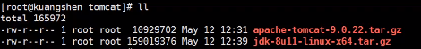
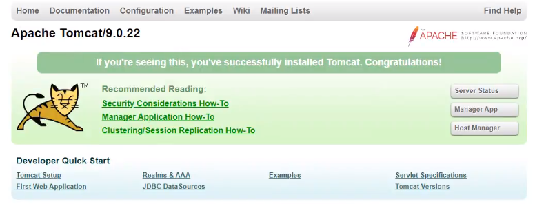

# 实战：Tomcat镜像

- 准备镜像文件tomcat压缩包，jdk的压缩包



- 编写对应的dockerfile文件

``` dockerfile
FROM centos
MAINTAINER abraham<1135530168@qq.com>

# 将dockerfile目录下的README.md拷贝到容器的指定目录下
COPY README.md /usr/local/README.md

# 会自动解压指定压缩包到容器指定目录内
ADD jdk-8ull-linux-x64.tar.gz /usr/local
ADD apache-tomcat-9.0.22.tar.gz /usr/local

# 容器内安装vim
RUN yum -y install vim

# 设置环境变量路径
ENV MYPATH /usr/local
WORKDIR $MYPATH

# 设置环境变量
ENV JAVA_HOME /usr/local/jdk1.8.0_11
ENV CLASSPATH $JAVA_HOME/lib/dt.jar;$JAVA_HOME/lib/tools.jar
ENV CATALINA_HOME /usr/local/apache-tomcat-9.0.22
ENV CATALINA_BASE /usr/local/apache-tomcat-9.0.22
ENV PATH $PATH:$JAVA_HOME/bin:$CATALINA_HOME/lib:$CATALINA_HOME/bin

# 暴露端口
EXPOSE 8080

# 附加启动tomcat和对应的日志
CMD /usr/local/apache-tomcat-9.0.22/bin/startup.sh && tail -F /usr/local/apache-tomcat-9.0.22/bin/logs/catalina.out
```

- 构建并运行

```shell
# 构建镜像
docker build -t a-tomcat .

# 启动镜像
docker run -d -p 9090:8080 --name tomcat01 -v /home/tomcat/abraham/test:/usr/local/apache-tomcat-9.0.22/webapps/test -v /home/tomcat/abraham/logs:/usr/local/apache-tomcat-9.0.22/logs a-tomcat

# 进入镜像
docker exec -it 836594a10c618 /bin/bash
```

- 测试

外网访问9090成功打开tomcat页面



- 发布项目

由于做了卷挂载，因此我们可以直接在本地编写就可以发布了

``` shell
cd /home/tomcat/abraham/test
```

把dist文件放入其中

访问http://localhost:9090/test

- 查看访问日志

``` shell
cd /home/tomcat/abraham/logs
ll
cat catalina.out
```

