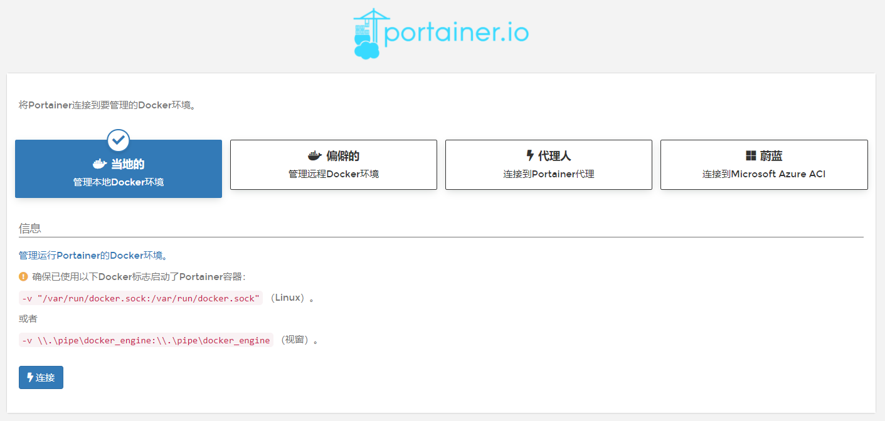
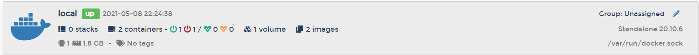
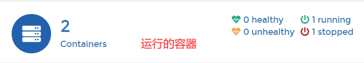
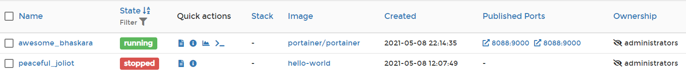

# Docker可视化

内网访问9000，外网访问8088

``` bash
[root@iZwz995sygwab04zwh0glhZ data]# docker run -d -p 8088:9000 --restart=always -v /var/run/docker.sock:/var/run/docker.sock --privileged=true portainer/portainer
```







