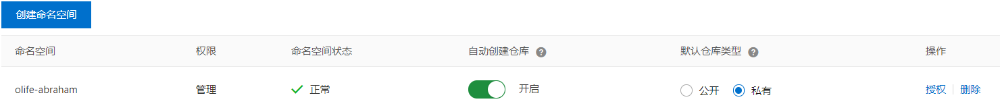
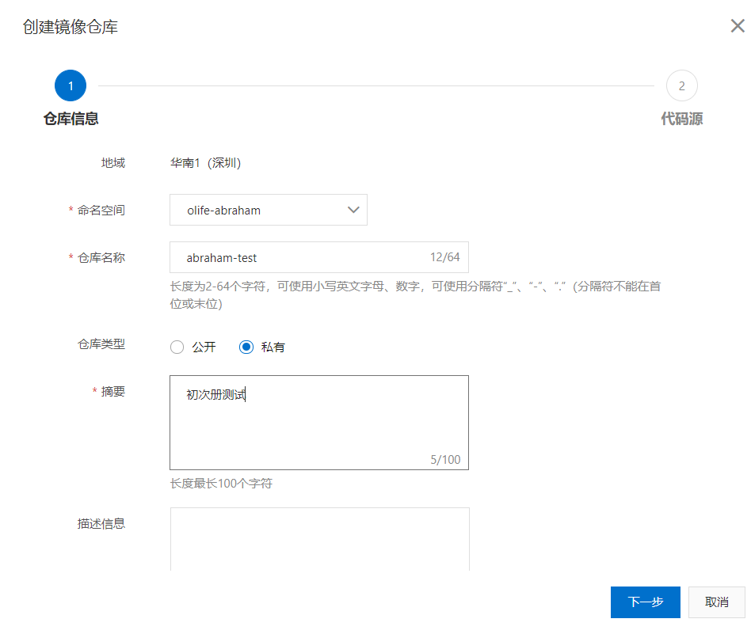
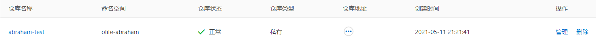

# 发布镜像

## dockerhub

- 登入dockerhub

``` shell
docker login -u abrahamvong
```

- 给镜像增加版本

``` shell
docker tag f8559dafi1f2 abraham/a-tomcat:1.0
```

- 将镜像提交到dockerhub上

``` shell
docker push abraham/a-tomcat:1.0
```

## Aliyun

- 找到容器镜像服务

- 创建个人实例

- 创建命名空间



- 创建容器镜像





- 进入仓库进行操作

登录阿里云Docker Registry

``` shell
$ sudo docker login --username=XXX registry.cn-shenzhen.aliyuncs.com
```

> 用于登录的用户名为阿里云账号全名，密码为开通服务时设置的密码。

> 您可以在访问凭证页面修改凭证密码。

从Registry中拉取镜像

``` shell
$ sudo docker pull registry.cn-shenzhen.aliyuncs.com/olife-abraham/abraham-test:[镜像版本号]
```

将镜像推送到Registry

``` shell
$ sudo docker login --username=XXX registry.cn-shenzhen.aliyuncs.com$ sudo docker tag [ImageId] registry.cn-shenzhen.aliyuncs.com/olife-abraham/abraham-test:[镜像版本号]$ sudo docker push registry.cn-shenzhen.aliyuncs.com/olife-abraham/abraham-test:[镜像版本号]
```

> 请根据实际镜像信息替换示例中的[ImageId]和[镜像版本号]参数。

选择合适的镜像仓库地址

> 从ECS推送镜像时，可以选择使用镜像仓库内网地址。推送速度将得到提升并且将不会损耗您的公网流量。

> 如果您使用的机器位于VPC网络，请使用 registry-vpc.cn-shenzhen.aliyuncs.com 作为Registry的域名登录。

示例

> 使用"docker tag"命令重命名镜像，并将它通过专有网络地址推送至Registry。

``` shell
$ sudo docker imagesREPOSITORY                                                         TAG                 IMAGE ID            CREATED             VIRTUAL SIZEregistry.aliyuncs.com/acs/agent                                    0.7-dfb6816         37bb9c63c8b2        7 days ago          37.89 MB$ sudo docker tag 37bb9c63c8b2 registry-vpc.cn-shenzhen.aliyuncs.com/acs/agent:0.7-dfb6816
```

> 使用 "docker push" 命令将该镜像推送至远程。

``` shell
$ sudo docker push registry-vpc.cn-shenzhen.aliyuncs.com/acs/agent:0.7-dfb6816
```
