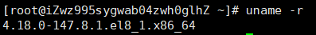

# 安装



内核必须在3.10以上

官网：https://docs.docker.com/


- 卸载旧的版本
``` bash
yum remove docker \
                  docker-client \
                  docker-client-latest \
                  docker-common \
                  docker-latest \
                  docker-latest-logrotate \
                  docker-logrotate \
                  docker-engine
```

- 配置需要的安装包

``` bash
yum install -y yum-utils
```

- 设置镜像的仓库

``` bash
yum-config-manager \
    --add-repo \
    http://mirrors.aliyun.com/docker-ce/linux/centos/docker-ce.repo
```

- 启动Docker

``` bash
systemctl start docker
```

- 验证Docker是否安装成功

``` bash
docker run hello-world
```


- 查看hello world镜像


- 卸载docker

``` bash
yum remove docker-ce docker-ce-cli containerd.io
```

``` bash
rm -rf /var/lib/docker
```

``` bash
rm -rf /var/lib/containerd
```

# 阿里云镜像加速


``` bash
sudo mkdir -p /etc/docker
sudo tee /etc/docker/daemon.json <<-'EOF'
 { 
"registry-mirrors": ["https://6j1rwuhx.mirror.aliyuncs.com"] 
}
 EOF
sudo systemctl daemon-reload
sudo systemctl restart docker
```
