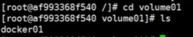

# 容器数据卷


## 简单卷挂载

使容器内的目录与本地内的目录双向同步

- 本地目录：/home/ceshi
- 容器目录：/home

``` bash
dcoker run -it -v /home/ceshi:/home centos /bin/bash
```


## 简单卷实战

``` bash
# 参数说明
-d 后台运行
-p 端口映射(本地端口:容器端口)
-v 卷挂载(本地目录:容器目录)
-e 环境配置(配置mysql密码)
--name 容器名字
docker run -d -p 3310:3306 -v /home/mysql/conf:/etc/mysql/conf.d -v /home/mysql/data:/var/lib/mysql -e MYSQL_ROOT_PASSWORD=123456 --name mysql01 mysql:5.7
```

即使容器被删除，这些配置与数据还完好无损的保存在挂载目录下


## 命令挂载方式

### 匿名挂载

我们只是指定路容器内的目录名却没有指定本地目录，所以面对的挂载的目录为匿名目录

``` bash
docker run -d -P --name nginx -v /etc/nginx nginx
```

查看所有卷信息

``` bash
docker run -d -P --name nginx -v /etc/nginx nginx
```


### 具名挂载

虽然同样没写本地目录，但这次挂载的容器目录带上定义的名字

``` bash
docker run -d -P --name nginx -v juming-nginx:/etc/nginx nginx
```


## 挂载路径

``` bash
docker volume inspect juming-nginx
```


### 挂载权限

``` bash
# -v [容器内的路径]:[ro/rw]
ro readonly # 只读
rw readwrite # 可读可写

# ro 配上了这个权限就只能通过宿主机来操作,容器内部是无法操作
# rw 双向都可以操作
docker run -d -P --name nginx01 -v juming-nginx:/etc/nginx:ro nginx
docker run -d -P --name nginx01 -v juming-nginx:/etc/nginx:rw nginx
```


## 数据容器卷

简单来说就是容器与容器之间进行挂载


把centos01的所有卷复制并挂载给centos02

``` bash
# 提交自己修改过的镜像
docker commit -m="我的Centos" -a="Abraham" 37406e27ca2c a-centos:1.0

# 运行一个a-centos命名为centos01
docker run -it centos01 a-centos:1.0

# 将centos01的目录也挂载给centos02
docker run -it --name centos02 --volumes-from centos01 a-centos:1.0

# 查看centos02容器的所有目录
ls -l
```


- 成功的把centos01的目录同步了过来


- 测试centos02的目录是否与centos01目录挂载

在centos01的volume01内创建docker01文件

``` bash
cd volume01
touch docker01
```

在centos02的volume01内也同步到了




## 数据容器卷实战

用--volumes-from实现mysql数据同步

``` bash
# 运行mysql01
docker run -d -p 3310:3306 -v /etc/mysql/conf.d -v /var/lib/mysql -e MYSQL_ROOT_PASSWORD=123456 --name mysql01 mysql:5.7

# 运行mysql02
docker run -d -p 3310:3306 -e MYSQL_ROOT_PASSWORD=456789 --name mysql02 --volumes-from mysql01 mysql:5.7
```

由于是双向拷贝的，所以无论发生什么，数据都不可能被彻底删除。

假如该容器已报废，其本身的数据卷不会报废，依旧可以被挂载